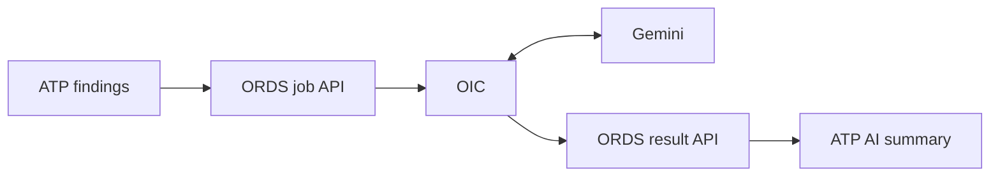
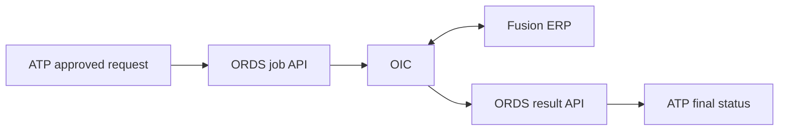
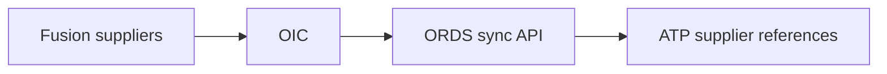

# Technical Design: Supplier Onboarding, Duplicate Detection and Risk Scoring

## 1. Purpose

This document describes the phase-one technical design for the supplier onboarding prototype. The solution allows a requester to submit a supplier, validates and assesses the request, supports human review, and sends an approved supplier to Oracle Fusion ERP.

The prototype uses:

- Oracle Visual Builder for the user interface
- ORDS for REST APIs
- Oracle ATP for application data and business rules
- Oracle Integration Cloud (OIC) for Gemini and Fusion integrations
- Gemini for advisory explanations and recommendations
- Oracle Fusion ERP as the supplier system of record

The user-facing roles are **Requester**, **Reviewer**, and **Admin**. Finance, compliance, and supplier-governance checks are included in the Reviewer experience.

## 2. Architecture


### 2.1 Component responsibilities

| Component | Responsibility |
|---|---|
| Visual Builder | Supplier form, request tracking, reviewer work queue, request detail, and admin integration views |
| ORDS | REST API boundary used by Visual Builder and OIC; invokes ATP procedures and returns JSON responses |
| ATP | Stores application data and executes authoritative validation, duplicate detection, risk scoring, and workflow rules |
| OIC | Calls Gemini and Fusion, transforms payloads, synchronizes supplier reference data, and reports integration results |
| Gemini | Produces advisory, plain-language risk and duplicate explanations; it does not approve or create suppliers |
| Fusion ERP | Creates the approved supplier and remains the supplier master system of record |

ORDS is the API layer; it does not calculate risk itself. An ORDS endpoint calls PL/SQL business procedures in ATP, and those procedures perform the deterministic checks.

### 2.2 Main processing flow

1. A requester creates and submits a supplier request in Visual Builder.
2. Visual Builder calls ORDS, which stores the request in ATP.
3. ATP validates the request, checks for duplicates, and calculates risk.
4. OIC reads an AI-explanation job through ORDS and sends the structured findings to Gemini.
5. OIC stores Gemini's explanation back in ATP through ORDS.
6. A reviewer approves, rejects, marks the request as duplicate, or requests correction.
7. OIC reads an approved request through ORDS and creates the supplier in Fusion.
8. OIC stores the Fusion supplier number or error in ATP through ORDS.
9. Visual Builder reads the latest status and results through ORDS.

### 2.3 Supplier-reference synchronization

OIC periodically reads existing suppliers from Fusion and sends the fields needed for matching to ATP through an ORDS batch endpoint. ATP uses this local reference cache when checking new requests for duplicates, so submission does **not** call Fusion for every request.

The cache is a supplier header with related tax-registration, site/address/contact, and bank-reference rows. It is not a second supplier-master system: it holds only data needed for matching, its Fusion source identifiers, and sync timestamps.

```text
Fusion ERP -> OIC -> ORDS -> ATP supplier reference data
```

## 3. Validation and Assessment Design

All authoritative checks run after submission in ATP. Visual Builder may repeat basic required-field checks to provide immediate feedback, but those UI checks are not authoritative.

| Check | Where performed | Stored as | Shown to user as |
|---|---|---|---|
| Required name, country, type, business unit, email, and address | ATP validation procedure | Validation results in `REQUEST_ASSESSMENT` | Field-level error or validation summary |
| Email and numeric formats | ATP validation procedure | Validation finding | Field-level error |
| Tax registration required for applicable country/type | ATP validation procedure using configuration | Validation and risk findings | Missing-tax warning or error |
| Incomplete address | ATP validation procedure | Validation or risk finding | Address warning/error |
| Bank country differs from supplier country | ATP validation procedure | Risk finding | Payment-risk warning |
| Missing expected bank details | ATP validation procedure | Risk finding | Risk warning |
| Missing expected document | ATP validation procedure against uploaded document metadata | Validation/risk finding | Missing-document warning |
| Business-unit and site mapping | ATP validation procedure | Validation finding | Mapping error before Fusion submission |
| Exact tax ID or bank-account match | ATP duplicate procedure against local Fusion tax/bank reference rows | Duplicate results in `REQUEST_ASSESSMENT` | Strong duplicate warning |
| Similar name/address, email domain, phone, and country | ATP duplicate procedure against local Fusion supplier/site reference rows | Duplicate match with score and reasons | Possible supplier matches |
| Overall risk score and level | ATP risk procedure | Request score/level plus risk findings | Low, Medium, High, or Critical with reasons |
| Vague business justification | Gemini through OIC | `AI_ASSESSMENT` | Advisory explanation and recommended correction; no numeric risk-score impact |
| Final supplier-field validity | Fusion during creation | `INTEGRATION_JOB` and request status | Creation success or business integration error |

### 3.1 Vague business justification

Gemini receives the business justification together with the deterministic findings and explains what information is missing. For example, it can identify that "needed for project" does not identify the project, service, owner, or reason an existing supplier cannot be used.

Gemini output is advisory. It does not approve, reject, create a supplier, or change the numeric risk score. The reviewer makes the final decision.

### 3.2 Deterministic risk score

ATP calculates the risk score from configured rules only. The initial model is designed to have a mathematical maximum of **100**:

```text
Risk score = base risk (maximum 55) + duplicate risk (maximum 45)
```

Gemini's assessment of the business justification is displayed beside the risk result but is deliberately excluded from this formula.

| Rule code | Deterministic condition | Initial weight |
|---|---|---:|
| `MISSING_TAX_ID` | Tax registration is required for the supplier's country/type and is missing | 10 |
| `MISSING_BANK_DETAILS` | Bank details are required by the configured supplier rule and are missing/incomplete | 5 |
| `BANK_COUNTRY_MISMATCH` | Bank country differs from supplier country | 10 |
| `HIGH_RISK_COUNTRY` | Supplier country appears on the admin-managed high-risk-country list | 15 |
| `INCOMPLETE_ADDRESS` | One or more configured address-quality components are missing | 0–5, scaled |
| `MISSING_EXPECTED_DOCUMENT` | A configured required document has not been uploaded | 5 |
| `HIGH_EXPECTED_SPEND` | Expected annual spend falls in a configured spend band | 0–5, banded |
| `EXACT_TAX_ID_MATCH` | Tax ID exactly matches an existing Fusion supplier reference | 45, duplicate component |
| `EXACT_BANK_MATCH` | Protected bank-account fingerprint exactly matches an existing Fusion supplier reference | 45, duplicate component |
| `DUPLICATE_SIMILARITY` | Non-exact duplicate score from name, address, country, email domain, and phone | 0, 10, or 20, duplicate component |

Initial score bands are:

| Score | Risk level |
|---:|---|
| 0–19 | Low |
| 20–39 | Medium |
| 40–69 | High |
| 70–100 | Critical |

The base-risk weights add up to 55 at most. The duplicate component is calculated as one value—rather than adding all duplicate indicators—and has a maximum of 45. Therefore, the configured initial model has a maximum score of `55 + 45 = 100`.

An Admin can change weights, thresholds, country lists, and score bands through the risk-rule configuration screen/API. The API must reject a configuration change if the maximum base risk plus the maximum duplicate component would exceed 100. Every `REQUEST_ASSESSMENT` records the applied rule code, configured weight, applied weight, and evidence in its `risk_factors_json` field. Changing a rule affects future assessments only; it does not rewrite earlier decisions.

The high-risk-country check uses two configuration entries: the `HIGH_RISK_COUNTRY` risk rule stores the point value, while active country-list entries store which countries should trigger that rule. When a submitted request's supplier country matches an active configured country, ATP applies the configured `HIGH_RISK_COUNTRY` weight and stores the matched country evidence in the assessment.

High expected spend is deterministic and can contribute to the score. If Gemini also considers the justification vague, the Reviewer sees both warnings, but only the high-spend rule contributes points.

#### Address completeness calculation

Mandatory address fields such as country, address line 1, and city are blocking validation checks. `INCOMPLETE_ADDRESS` is a separate non-blocking quality check, evaluated only after those mandatory fields are present.

For each country, the Admin configures the address-quality components to assess, for example `state_or_province` and `postal_code`. ATP calculates:

```text
address points = ceiling(max address weight × missing quality components / expected quality components)
```

With a maximum weight of 5 and two configured quality components:

| Missing components | Address points |
|---:|---:|
| 0 of 2 | 0 |
| 1 of 2 | 3 |
| 2 of 2 | 5 |

The Admin may change the components and the maximum weight. Countries that do not use postal codes, for example, can exclude that component from their configuration.

#### Expected-spend calculation

ATP converts `expectedAnnualSpend` to a configured base currency at submission and stores the converted amount and conversion rate with the request assessment. The prototype can use USD as the base currency.

The initial Admin-configurable bands are:

| Annual spend in base currency | Spend points |
|---:|---:|
| Less than 100,000 | 0 |
| 100,000 to less than 250,000 | 2 |
| 250,000 to less than 500,000 | 3 |
| 500,000 or more | 5 |

Spend is assessed from the amount alone. Gemini may call the justification vague, but that AI result does not add points or alter the spend band.

#### Duplicate-similarity calculation

Tax ID and bank-account matches are exact, binary checks. ATP compares the request's normalized tax or bank value with protected deterministic fingerprints in the local Fusion reference cache; it does not call Fusion at submission time. They are not added together. ATP uses the strongest duplicate indicator for the request: 45 for an exact tax-ID match, 45 for an exact bank-account match, or the non-exact similarity value below. If both exact values match, the duplicate component is 45, not 90.

For non-exact candidates, ATP calculates a deterministic duplicate score from 0 to 100. Supplier names are normalized first by lowercasing and removing punctuation and common suffixes such as `Ltd`, `Limited`, and `Inc`.

```text
duplicate score =
  (55 × name similarity + 20 × address similarity + 10 × country match
   + 10 × email-domain match + 5 × phone match)
  / sum of weights for available fields
```

Each similarity/match value is between 0 and 100. Country, email-domain, and phone matches are either 100 (match) or 0 (no match). For phase one, name and address similarity use ATP's `UTL_MATCH.JARO_WINKLER_SIMILARITY` after normalization. A non-exact candidate must have a normalized name similarity of at least 70 and the same country before it can receive duplicate-similarity risk points.

ATP uses the highest eligible non-exact candidate score for the request:

| Highest duplicate score | Duplicate-similarity points |
|---:|---:|
| Less than 70 | 0 |
| 70 to less than 85 | 10 |
| 85 or more | 20 |

The non-exact similarity points are not added for a candidate that already has an exact tax-ID or bank-account match, avoiding double-counting its name/address similarity. In all cases, ATP takes the highest duplicate contribution across the possible matches, up to 45.

#### Stored calculation evidence

`REQUEST_ASSESSMENT.risk_factors_json` stores the exact inputs and weights used, for example:

```json
[
  {
    "ruleCode": "INCOMPLETE_ADDRESS",
    "maxWeight": 5,
    "expectedComponents": 2,
    "missingComponents": 1,
    "appliedWeight": 3
  },
  {
    "ruleCode": "HIGH_EXPECTED_SPEND",
    "baseCurrencyAmount": 300000,
    "band": "250000_TO_499999",
    "appliedWeight": 3
  },
  {
    "ruleCode": "HIGH_RISK_COUNTRY",
    "countryCode": "IR",
    "matchedConfigKey": "IR",
    "configuredWeight": 15,
    "appliedWeight": 15
  },
  {
    "ruleCode": "DUPLICATE_SIMILARITY",
    "candidateSupplierNumber": "SUP-004512",
    "duplicateScore": 87.5,
    "appliedWeight": 20
  }
]
```

### 3.3 Result communication

The request-detail API returns one combined response containing:

- Current request status
- Validation findings
- Duplicate matches and reasons
- Risk score and contributing factors
- Latest AI summary and recommendations
- Review history
- Fusion supplier number or integration error

Visual Builder presents the relevant parts to each role. Sensitive bank values are always masked.

## 4. ORDS API Design

### 4.1 Conventions

- Module name: `ha_supplier_onboarding_v1`
- Base path: `/ords/<schema>/ha_v1/` (example: `/ords/supplier-onboarding/ha_v1/`)
- Content type: `application/json`, except document upload/download
- IDs are generated by ATP and returned by the API.
- Timestamps use UTC ISO 8601 format.
- List endpoints support pagination with `limit` and `offset`.
- Authenticated caller identity is passed via `actor_subject_id` and `actor_roles` HTTP headers. Oracle IAM supplies these to Visual Builder and ORDS. ATP stores identity references for ownership and audit, not a duplicate user directory.

### 4.2 Visual Builder APIs

#### Why create and submit are separate

`POST /requests` only creates a saved request and returns its ID. The requester can then finish the form and upload documents against that ID.

`POST /requests/{requestId}/submit` is a business action. It confirms that data entry is complete, increments the request version, and triggers validation, duplicate detection, risk scoring, and the AI-explanation job.

These endpoints are therefore not duplicates:

```text
Create request -> receive request ID -> upload documents -> submit for assessment
```

The current requirements explicitly include Draft status and attachment upload, so retaining drafts is recommended. Removing Draft would require the create call to submit the complete request and its documents in one operation, or require a temporary document-upload mechanism. Either approach makes the prototype more complicated rather than simpler.

| Method | Endpoint | Purpose | Role |
|---|---|---|---|
| `GET` | `/` | Root discovery: lists available resources and API version | All |
| `GET` | `/health` | Health check: confirms the service is running | All |
| `POST` | `/requests` | Create a draft request | Requester |
| `PUT` | `/requests/{requestId}` | Update an editable request | Requester |
| `GET` | `/requests` | List requests with status, risk, requester, country, and business-unit filters | All, role-filtered |
| `GET` | `/requests/{requestId}` | Get request details and assessment results | All, role-filtered |
| `POST` | `/requests/{requestId}/submit` | Run validation, duplicate checking, and risk scoring | Requester |
| `POST` | `/requests/{requestId}/documents` | Upload a supporting document | Requester |
| `GET` | `/requests/{requestId}/documents/{documentId}` | Download an authorized document | Requester/Reviewer |
| `POST` | `/requests/{requestId}/review` | Approve, reject, mark duplicate, or request correction | Reviewer |
| `POST` | `/requests/{requestId}/justification-risk-adjustment` | Apply a reviewer-entered risk-point adjustment for justification quality | Reviewer |
| `POST` | `/requests/{requestId}/ai-regeneration` | Queue a new AI explanation after request changes | Reviewer |
| `POST` | `/requests/{requestId}/retry` | Queue an eligible failed Fusion request for retry | Admin |
| `GET` | `/integration-logs` | View integration attempts and errors | Admin |
| `GET` | `/integration-jobs` | Read the OIC work queue (filterable by `type` and `status`) | OIC / Admin |
| `GET` | `/action-history` | View the full audit trail of status changes and reviewer decisions | Reviewer / Admin |
| `GET` | `/risk-rules` | View risk weights, thresholds, and score bands | Admin |
| `PUT` | `/risk-rules/{ruleCode}` | Update a risk rule weight or active flag | Admin |
| `GET` | `/high-risk-countries` | View configured high-risk countries | Admin |
| `PUT` | `/high-risk-countries/{countryCode}` | Add, update, activate, or deactivate a high-risk country entry | Admin |

#### Create request example

```http
POST /ords/supplier-onboarding/ha_v1/requests
Content-Type: application/json
actor_subject_id: REQ_AMINA_SUB
actor_roles: REQUESTER
```

```json
{
  "supplier_name": "ABC Technologies Ltd.",
  "supplier_type": "COMPANY",
  "country_code": "PK",
  "address_line1": "12 Main Road",
  "address_line2": null,
  "city": "Karachi",
  "state_or_province": "Sindh",
  "postal_code": "74000",
  "contact_person": "Ali Khan",
  "contact_email": "ali@abctech.example",
  "contact_phone": "+92-21-5550100",
  "business_unit": "PK_OPERATIONS",
  "business_justification": "Needed to provide equipment maintenance for Plant A.",
  "product_service_category": "MAINTENANCE",
  "expected_annual_spend": 150000,
  "currency_code": "USD",
  "tax_registration_number": "PK-1234567",
  "bank_country_code": "PK",
  "bank_currency_code": "PKR",
  "bank_account_raw": "1234567890",
  "site_name": "KARACHI_SITE",
  "site_address_line1": "12 Main Road",
  "site_city": "Karachi",
  "site_country_code": "PK",
  "requester_display_name": "Amina Siddiqui",
  "requester_email": "amina@example.com"
}
```

```json
{
  "request_id": 1024
}
```

> **Note**: The `request_number` (e.g., `SR-001024`) is generated by ATP and readable via the subsequent `GET /requests/{requestId}` call. The `bank_account_raw` value is encrypted in ATP and never returned to any UI endpoint; only `bank_account_last_four` and `bank_country_code` are returned.

#### Submit response example

```http
POST /ords/supplier-onboarding/ha_v1/requests/1024/submit
actor_subject_id: REQ_AMINA_SUB
actor_roles: REQUESTER
```

```json
{
  "status": "UNDER_REVIEW"
}
```

The submit handler returns the resulting request status. The full assessment results (validation findings, duplicate matches, risk score and factors, AI status) are read separately via `GET /requests/{requestId}`.

#### Review request example

```http
POST /ords/supplier-onboarding/ha_v1/requests/1024/review
Content-Type: application/json
actor_subject_id: REV_PRIYA_SUB
actor_roles: REVIEWER
```

```json
{
  "decision": "APPROVE",
  "reason": "Tax and bank details verified",
  "existing_supplier_id": null
}
```

The body field is `decision` (not `action`). Allowed values are `APPROVE`, `REJECT`, `MARK_DUPLICATE`, and `REQUEST_CORRECTION`. `MARK_DUPLICATE` also accepts a non-null `existing_supplier_id`.

#### Justification risk adjustment example

```http
POST /ords/supplier-onboarding/ha_v1/requests/1024/justification-risk-adjustment
Content-Type: application/json
actor_subject_id: REV_PRIYA_SUB
actor_roles: REVIEWER
```

```json
{
  "points": 5,
  "reason": "Business justification is vague and does not name a specific project or existing supplier considered."
}
```

Allowed `points` values are `0`, `3`, `5`, and `10` (enforced by `req_assess_adjust_pts_chk` check constraint). The adjustment is stored in `REQUEST_ASSESSMENT` as `reviewer_adjustment_points` and added to `deterministic_risk_score` to produce the final `risk_score`. The adjustment is recorded once per assessment version; a new resubmission resets it.

### 4.3 OIC-facing APIs

| Method | Endpoint | Purpose |
|---|---|---|
| `GET` | `/integration-jobs?type=AI_EXPLANATION&status=READY` | Read pending Gemini work |
| `GET` | `/integration-jobs?type=FUSION_CREATE&status=READY` | Read approved supplier-creation work |
| `GET` | `/integration-jobs?type=SUPPLIER_SYNC&status=READY` | Read a queued reference-cache refresh or retry |
| `POST` | `/integration-jobs/{jobId}/claim` | Mark a job as being processed by an OIC instance; body accepts `oic_instance_id` and `correlation_id` |
| `PUT` | `/integration-jobs/{jobId}/result` | Store success or failure and update the request; body accepts `job_status`, `response_reference`, `error_type`, `error_message`, `retryable`, `fusion_supplier_id`, `fusion_supplier_number`, `ai_summary`, `ai_recommended_actions`, `justification_quality`, and `model_name` |
| `POST` | `/supplier-reference/batch` | Upsert the Fusion supplier header, tax, site/address/contact, and bank-match reference data |

The job response contains a payload appropriate to the integration type so OIC does not need direct table access.

> **Note**: `/integration-logs` (GET) and `/integration-jobs` (GET) both query the same `INTEGRATION_JOB` table through `integration_log_safe_v`. `/integration-logs` is the Admin-facing view ordered by `updated_at desc`; `/integration-jobs` is the OIC queue view ordered by `created_at` (FIFO). Both support `type`, `status`, `limit`, and `offset` query parameters.

#### Fusion result example

```http
PUT /ords/supplier-onboarding/v1/integration-jobs/300/result
Content-Type: application/json
```

```json
{
  "status": "SUCCESS",
  "oicInstanceId": "987654321",
  "fusionSupplierId": "98421",
  "fusionSupplierNumber": "SUP-0098421",
  "responseReference": "fusion-response-300"
}
```

Failure example:

```json
{
  "status": "FAILED",
  "oicInstanceId": "987654322",
  "errorType": "TECHNICAL",
  "errorCode": "FUSION_TIMEOUT",
  "errorMessage": "Fusion supplier API timed out",
  "retryable": true
}
```

#### Supplier-reference sync example

```http
POST /ords/supplier-onboarding/v1/supplier-reference/batch
Content-Type: application/json
```

```json
{
  "syncId": "SYNC-20260716-01",
  "suppliers": [
    {
      "fusionSupplierId": "4512",
      "supplierNumber": "SUP-004512",
      "supplierName": "ABC Tech Limited",
      "supplierType": "COMPANY",
      "active": true,
      "sourceLastUpdatedAt": "2026-07-16T02:15:00Z",
      "taxRegistrations": [
        {
          "fusionTaxReferenceId": "TAX-4512-PK",
          "countryCode": "PK",
          "taxType": "NTN",
          "taxRegistrationNumber": "PK-1234567",
          "active": true
        }
      ],
      "sites": [
        {
          "fusionSupplierSiteId": "SITE-4512-KHI",
          "siteName": "KARACHI_SITE",
          "countryCode": "PK",
          "addressLine1": "12 Main Road",
          "city": "Karachi",
          "stateOrProvince": "Sindh",
          "postalCode": "74000",
          "contactEmail": "ap@abctech.example",
          "phone": "+92-21-5550100",
          "active": true
        }
      ],
      "bankAccounts": [
        {
          "fusionBankAccountId": "BANK-4512-01",
          "bankCountryCode": "PK",
          "currencyCode": "PKR",
          "bankAccountNumber": "1234567890",
          "active": true
        }
      ]
    }
  ]
}
```

ORDS validates the batch, normalizes names, addresses, email domains, phone numbers, tax IDs, and bank-account identifiers, then upserts the four local reference tables. Raw Fusion bank-account and tax-registration values are used only while processing the request; the reference cache retains protected fingerprints and masked display values, not the raw values. The successful response should return the `syncId` plus header/tax/site/bank upsert counts and any rejected records.

### 4.4 Standard errors

ORDS returns a consistent error body:

```json
{
  "code": "INVALID_STATUS_TRANSITION",
  "message": "Only an UNDER_REVIEW request can be approved.",
  "correlationId": "a62b5bb1-49ba-4ac6-8c1e-4e1df2a31ee8"
}
```

Suggested HTTP statuses are `200/201` for success, `400` for invalid input, `403` for unauthorized role, `404` for missing data, `409` for invalid status or concurrent update, and `500` for an unexpected server error.

## 5. OIC Integration Overview

### 5.1 AI explanation integration

**Trigger:** Scheduled polling of ready `AI_EXPLANATION` jobs.



1. OIC retrieves and claims a ready AI job through ORDS.
2. The job supplies the request, validation findings, duplicate reasons, and risk factors.
3. OIC removes or masks bank and other unnecessary sensitive data.
4. OIC calls Gemini with a versioned prompt requesting structured JSON.
5. OIC validates the response and returns the summary and recommended actions through the job-result endpoint.
6. ATP stores the output in `AI_ASSESSMENT` and marks the job complete.

An AI failure is recorded but does not become a business-validation failure and does not prevent manual review.

### 5.2 Fusion supplier-creation integration

**Trigger:** Scheduled polling of ready `FUSION_CREATE` jobs created when a reviewer approves a request.



1. OIC retrieves and claims an approved supplier job.
2. OIC transforms the ORDS payload into the Fusion supplier REST payload.
3. OIC calls the Fusion supplier API.
4. On success, OIC returns the Fusion supplier ID and supplier number. ATP changes the request to `CREATED_IN_FUSION` and queues a `SUPPLIER_SYNC` refresh for that supplier.
5. On failure, OIC returns the error category, message, and retryability. ATP changes the request to `INTEGRATION_FAILED`.

The request ID and job ID form the idempotency reference. Retrying a technical failure creates another logged attempt but does not bypass approval.

The immediate `SUPPLIER_SYNC` job uses the just-created request/Fusion payload to upsert the supplier reference cache through `/supplier-reference/batch`, so a supplier created moments ago can be detected for the next request without waiting for the nightly sync. A later scheduled Fusion delta sync reconciles the cached values with Fusion's authoritative version. If this cache refresh fails, supplier creation remains successful; the separate sync job is retried and shown to Admin.

### 5.3 Fusion supplier-master synchronization

**Trigger:** Scheduled, for example nightly during the prototype, plus an immediate refresh job after successful supplier creation.



1. OIC reads new or changed suppliers, tax registrations, supplier sites/addresses/contacts, and payment-bank references from Fusion.
2. OIC maps only the fields needed for duplicate matching and retains Fusion IDs so each local row can be upserted.
3. OIC sends suppliers in batches to the ORDS supplier-reference endpoint.
4. ATP upserts `FUSION_SUPPLIER_REF` and its tax, site, and bank-reference children; it calculates the local match keys and discards raw bank/tax values after processing.
5. OIC records the sync result, `syncId`, counts, and errors in `INTEGRATION_JOB` for admin visibility.

The sync is incremental when Fusion exposes a last-updated marker. An omitted child row is **not** treated as deleted during an incremental sync. ATP deactivates a local reference row only when Fusion explicitly marks it inactive, or when a successful full-snapshot sync confirms that it is absent. This prevents a partial batch from accidentally removing valid duplicate candidates.

If Fusion access is unavailable, OIC can call a mock endpoint while preserving the expected request and response structure.

## 6. Data Model

The phase-one request model deliberately keeps one requested site, contact, address, and bank account on `SUPPLIER_REQUEST`. The **Fusion reference cache** is different: Fusion suppliers can have several tax registrations, sites, and bank accounts, so it uses small child tables. This keeps duplicate detection correct without over-engineering the user-entered request model.

### 6.1 Oracle IAM identity and roles

Oracle IAM provides the user directory and role assignment. Therefore, ATP does **not** need physical `APP_USER`, `APP_ROLE`, or `USER_ROLE` tables.

The logical ER diagram below still shows user relationships because ownership and audit are required. `ORACLE_IAM_USER` is an external IAM entity, not an ATP table and not a database foreign-key target. Oracle IAM also manages the external `REQUESTER`, `REVIEWER`, and `ADMIN` role assignments; roles are intentionally not represented as ATP tables.

1. Oracle IAM authenticates the user and supplies their stable subject/identity plus application roles.
2. Visual Builder uses the roles to show the correct pages and actions.
3. ORDS validates the caller and invokes ATP procedures with the authenticated identity passed in the `actor_subject_id` and `actor_roles` HTTP headers.
4. ATP enforces ownership and audit rules using identity columns such as `requester_subject_id` and `actor_subject_id`.
5. OIC uses its own technical service identity for integration endpoints; it is not an end-user role.

Use the stable identity subject supplied by IAM (for example, an OIDC `sub` claim) rather than an email address as the stored value. Display name and email can change; the stable subject should not.

```mermaid
erDiagram
    ORACLE_IAM_USER {
        string subject_id PK
        string username
    }
    SUPPLIER_REQUEST {
        number request_id PK
        string requester_subject_id
        string request_number
        string status
        number risk_score
        string risk_level
    }
    REQUEST_DOCUMENT {
        number document_id PK
        number request_id FK
        number request_version
        string uploaded_by_subject_id
        string document_type
        string is_latest
    }
    REQUEST_ASSESSMENT {
        number assessment_id PK
        number request_id FK
        number request_version
        string is_latest
        string validation_status
        string validation_results_json
        string duplicate_level
        string duplicate_matches_json
        number deterministic_risk_score
        number reviewer_adjustment_points
        string reviewer_adjustment_reason
        number risk_score
        string risk_level
        string risk_factors_json
        string reference_sync_id
        string assessed_at
    }
    FUSION_SUPPLIER_REF {
        string fusion_supplier_id PK
        string supplier_number
        string supplier_name
        string supplier_name_normalized
        string supplier_type
        string active
        string source_last_updated_at
        string last_seen_sync_id
    }
    FUSION_SUPPLIER_TAX_REF {
        string fusion_tax_reference_id PK
        string fusion_supplier_id FK
        string country_code
        string tax_type
        string tax_id_fingerprint
        string tax_id_masked
        string active
    }
    FUSION_SUPPLIER_SITE_REF {
        string fusion_supplier_site_id PK
        string fusion_supplier_id FK
        string site_name
        string country_code
        string address_normalized
        string email_domain
        string phone_normalized
        string active
    }
    FUSION_SUPPLIER_BANK_REF {
        string fusion_bank_account_id PK
        string fusion_supplier_id FK
        string bank_country_code
        string currency_code
        string bank_account_fingerprint
        string bank_account_last_four
        string active
    }
    AI_ASSESSMENT {
        number ai_assessment_id PK
        number request_id FK
        number request_version
        string is_latest
        string justification_quality
        string model_name
        string status
    }
    ACTION_HISTORY {
        number action_history_id PK
        number request_id FK
        string actor_subject_id
        string action
        string from_status
        string to_status
    }
    INTEGRATION_JOB {
        number job_id PK
        number request_id FK
        string integration_type
        string status
        number attempt_number
    }
    CONFIGURATION {
        string config_type PK
        string config_key PK
        string updated_by_subject_id
        string config_value
        string active
        string updated_at
    }
    RISK_RULE_CONFIG {
        string rule_code PK
        string component
        number weight_points
        string active
    }
    RISK_SCORE_BAND_CONFIG {
        string risk_level PK
        number min_score
        number max_score
        string active
    }
    HIGH_RISK_COUNTRY_CONFIG {
        string country_code PK
        string reason
        string source_name
        string active
    }
    TAX_REQUIREMENT_CONFIG {
        string country_code PK
        string supplier_type PK
        string required
        string active
    }
    BUSINESS_UNIT_SITE_MAPPING {
        string business_unit PK
        string site_name PK
        string site_country_code PK
        string active
    }
    GENERIC_JUSTIFICATION_PHRASE {
        string phrase_key PK
        string phrase_text
        string severity
        string active
    }
    SUPPLIER_REQUEST ||--o{ REQUEST_DOCUMENT : has
    SUPPLIER_REQUEST ||--o{ REQUEST_ASSESSMENT : has
    SUPPLIER_REQUEST ||--o{ AI_ASSESSMENT : has
    SUPPLIER_REQUEST ||--o{ ACTION_HISTORY : has
    SUPPLIER_REQUEST ||--o{ INTEGRATION_JOB : has
    FUSION_SUPPLIER_REF ||--o{ FUSION_SUPPLIER_TAX_REF : has
    FUSION_SUPPLIER_REF ||--o{ FUSION_SUPPLIER_SITE_REF : has
    FUSION_SUPPLIER_REF ||--o{ FUSION_SUPPLIER_BANK_REF : has
    FUSION_SUPPLIER_REF }o--o{ REQUEST_ASSESSMENT : candidate_in
    RISK_RULE_CONFIG ||--o{ REQUEST_ASSESSMENT : supplies_rules_for
    HIGH_RISK_COUNTRY_CONFIG ||--o{ REQUEST_ASSESSMENT : country_check
    TAX_REQUIREMENT_CONFIG ||--o{ REQUEST_ASSESSMENT : tax_check
    ORACLE_IAM_USER ||--o{ SUPPLIER_REQUEST : requester
    ORACLE_IAM_USER ||--o{ REQUEST_DOCUMENT : uploader
    ORACLE_IAM_USER ||--o{ ACTION_HISTORY : actor
    ORACLE_IAM_USER ||--o{ RISK_RULE_CONFIG : updated_by
    ORACLE_IAM_USER ||--o{ HIGH_RISK_COUNTRY_CONFIG : updated_by
```



### 6.2 ATP tables

#### `SUPPLIER_REQUEST`

Main request and current-state record.

Key fields:

- `request_id`, `request_number`
- `requester_subject_id`, `status`, `request_version`
- Supplier name, type, country, address, contact, business unit, category, and justification
- Expected spend and currency
- Tax registration number
- Protected bank account, bank-account fingerprint, last four digits, and bank country
- Site name and site address
- Current risk score/level and duplicate level
- Fusion supplier ID/number
- Created and updated timestamps

`requester_subject_id` stores the Oracle IAM subject/identity for the requester. It is an external logical reference, not an ATP foreign key. A requester can view only requests where this value matches their authenticated identity.

| Role | Access |
|---|---|
| Requester | Create, edit, submit, and track their own requests; upload documents |
| Reviewer | View the work queue; assess evidence; approve, reject, mark duplicate, or request correction |
| Admin | View and retry integration failures; manage risk-rule configuration |

#### `REQUEST_DOCUMENT`

Stores attachment metadata and the document BLOB for the prototype.

Key fields: `document_id`, `request_id`, `request_version`, `document_type`, `file_name`, `mime_type`, `document_content`, `is_latest`, `uploaded_by_subject_id`, and `uploaded_at`.

`is_latest` marks the current active document for a request and document type. When a requester replaces a document, ATP keeps the older row for audit but sets its `is_latest` value to `N`; the new uploaded row becomes `Y`. Validation and review screens should use only latest documents unless the user is viewing history.

#### `REQUEST_ASSESSMENT`

Stores the complete deterministic assessment for one submitted version of a request.

Key fields:

- `assessment_id`, `request_id`, `request_version`, and `is_latest`
- `validation_status` and `validation_results_json`
- `duplicate_level` and `duplicate_matches_json`
- `deterministic_risk_score` — the score calculated by ATP rules before any reviewer adjustment
- `reviewer_adjustment_points` — a reviewer-entered point adjustment (allowed values: `0`, `3`, `5`, `10`) applied after the deterministic calculation for justification quality concerns
- `reviewer_adjustment_reason` — free-text explanation for the adjustment, stored with `reviewer_adjusted_by_subject_id` and `reviewer_adjusted_at`
- `risk_score` — the final score (`deterministic_risk_score + reviewer_adjustment_points`), stored on both the assessment and the parent `SUPPLIER_REQUEST`
- `risk_level` and `risk_factors_json`, including applied weights and evidence
- `reference_sync_id`, identifying the local Fusion-cache version used for duplicate matching
- `assessed_by_subject_id` and `assessed_at`

Example JSON values can retain field-level findings and duplicate reasons without requiring separate tables for every calculation. A new assessment row is created after each resubmission, preserving the earlier result.

`is_latest` marks the latest deterministic assessment for the request. When a request is resubmitted, ATP sets the previous latest assessment to `N` and inserts the new assessment with `is_latest = Y`. Visual Builder normally reads the latest row, while Admin/audit views can still show the full assessment history.

To keep these flags reliable, ATP should update the relevant old `is_latest` row inside the same transaction that inserts the replacement document, new deterministic assessment, or regenerated AI assessment. The intended uniqueness rules are one latest assessment per request, one latest document per request/document type, and one latest AI assessment per request/request version.

#### `FUSION_SUPPLIER_REF`

Local header reference for an existing Fusion supplier, used only for matching. It holds `fusion_supplier_id`, `supplier_number`, supplier name and normalized name, supplier type, `active`, `source_last_updated_at`, `last_seen_sync_id`, and `last_synced_at`.

It deliberately does **not** contain a single supplier-wide address, tax ID, or bank account: a Fusion supplier may have several of each. Those values belong in the child reference tables below. `supplier_name_normalized` is used to select fuzzy-match candidates quickly; the detailed comparison then uses the child site rows.

#### `FUSION_SUPPLIER_TAX_REF`

One active or historical Fusion tax registration for a supplier. Key fields are `fusion_tax_reference_id`, `fusion_supplier_id`, `country_code`, `tax_type`, `tax_id_fingerprint`, `tax_id_masked`, `active`, `source_last_updated_at`, `last_seen_sync_id`, and `last_synced_at`.

ATP normalizes a tax identifier before creating its deterministic fingerprint. On request submission, ATP creates the same fingerprint from the request tax value and looks it up locally to perform the exact-tax-ID check. The raw Fusion tax value is not retained in this cache; `tax_id_masked` is available only for an authorized reviewer display if needed.

#### `FUSION_SUPPLIER_SITE_REF`

One Fusion supplier site/contact matching record. Key fields are `fusion_supplier_site_id`, `fusion_supplier_id`, `site_name`, `site_number`, `country_code`, `address_line1`, `address_line2`, `city`, `state_or_province`, `postal_code`, `address_normalized`, `email_domain`, `phone_normalized`, `active`, `source_last_updated_at`, `last_seen_sync_id`, and `last_synced_at`.

`address_normalized` combines the normalized address components for deterministic Jaro-Winkler comparison. `email_domain` and `phone_normalized` allow the remaining duplicate-score inputs to be checked without using the full contact email or an unnormalized phone number. There may be multiple site rows for one Fusion supplier; ATP uses the best eligible site match and records the selected site ID in `duplicate_matches_json`.

#### `FUSION_SUPPLIER_BANK_REF`

One Fusion payment-bank reference. Key fields are `fusion_bank_account_id`, `fusion_supplier_id`, `bank_country_code`, `currency_code`, `bank_account_fingerprint`, `bank_account_last_four`, `active`, `source_last_updated_at`, `last_seen_sync_id`, and `last_synced_at`.

`bank_account_fingerprint` is a deterministic HMAC-SHA-256 value calculated from a normalized bank-account identifier. It supports exact duplicate detection but cannot be used to reconstruct the account number. The full bank account number is neither stored in this reference cache nor returned to Visual Builder. For a local QA database, a plain SHA-256 fingerprint is acceptable only as test data; production must use HMAC with a protected per-environment key.

#### Local Fusion-cache matching rules

On submission, ATP runs the following local lookups before calculating the duplicate component:

| Requested field | Local reference source | Match used |
|---|---|---|
| Tax registration number | `FUSION_SUPPLIER_TAX_REF` | Exact tax fingerprint |
| Bank account number | `FUSION_SUPPLIER_BANK_REF` | Exact bank-account fingerprint |
| Supplier name | `FUSION_SUPPLIER_REF` | Normalized name candidate / fuzzy name score |
| Country, address, email domain, phone | `FUSION_SUPPLIER_SITE_REF` | Candidate eligibility and similarity inputs |

Only active reference rows are candidates. The resulting supplier number, selected site/tax/bank reference IDs, scores, and reasons are copied into `REQUEST_ASSESSMENT.duplicate_matches_json`; `reference_sync_id` records the cache version used. This preserves the result even if the next Fusion sync changes a reference row.

#### `AI_ASSESSMENT`

Stores each Gemini response so regenerated summaries do not overwrite history.

Key fields: `ai_assessment_id`, `request_id`, `request_version`, `is_latest`, `summary`, `recommended_actions`, `justification_quality`, `model_name`, `status`, and `generated_at`.

`is_latest` marks the latest Gemini response for that request version. If the Reviewer regenerates the explanation three times for request version 2, only the newest version-2 AI response has `is_latest = Y`; the older responses stay available for audit.

#### `ACTION_HISTORY`

Stores status changes and auditable reviewer decisions in one place.

Key fields: `action_history_id`, `request_id`, `action`, `from_status`, `to_status`, `reason`, `existing_supplier_id`, `actor_subject_id`, and `action_at`.

#### `INTEGRATION_JOB`

Acts as both the small integration work queue and attempt history. Each retry creates a new row linked to the original job.

Key fields: `job_id`, `parent_job_id`, `request_id`, `integration_type`, `status`, `attempt_number`, `oic_instance_id`, `payload_reference`, `response_reference`, `error_type`, `error_message`, `retryable`, and timestamps.

`integration_type` is `AI_EXPLANATION`, `FUSION_CREATE`, or `SUPPLIER_SYNC`.

#### `CONFIGURATION`

A general-purpose key/value table for miscellaneous settings that do not warrant their own table. The `config_value` column stores a plain string or a compact JSON string (up to 4 000 characters). Admin users can read and update entries through the Admin UI or ORDS configuration endpoints.

Key fields: `config_type`, `config_key`, `config_value`, `active`, `description`, `updated_by_subject_id`, and `updated_at`.

> **Note**: In the implemented schema, risk rules, score bands, high-risk countries, tax requirements, business-unit mappings, and justification phrases each have their own dedicated table (see below). The generic `CONFIGURATION` table is reserved for settings that do not fit those dedicated structures.

#### `RISK_RULE_CONFIG`

Dedicated table for risk-rule definitions and weights. Each row represents one configurable scoring rule.

Key fields: `rule_code` (PK), `component` (`BASE` or `DUPLICATE`), `rule_name`, `condition_description`, `weight_points`, `active`, `display_order`, `updated_by_subject_id`, and `updated_at`.

The `weight_points` check constraint allows values between `0` and `100`. The Admin UI enforces the business rule that the sum of active `BASE` weights may not exceed 55 and the active `DUPLICATE` maximum may not exceed 45. ORDS exposes this table through `GET /risk-rules` (read) and `PUT /risk-rules/{ruleCode}` (update weight and active flag).

#### `RISK_SCORE_BAND_CONFIG`

Defines the score ranges for each risk level label.

Key fields: `risk_level` (PK — `LOW`, `MEDIUM`, `HIGH`, or `CRITICAL`), `min_score`, `max_score`, `active`, `display_order`, `updated_by_subject_id`, and `updated_at`.

#### `HIGH_RISK_COUNTRY_CONFIG`

Dedicated table for the Admin-managed high-risk-country list. Replaces the generic `CONFIGURATION HIGH_RISK_COUNTRY` rows described in earlier drafts.

Key fields: `country_code` (PK, 2-char), `reason`, `source_name`, `effective_date`, `active`, `updated_by_subject_id`, and `updated_at`.

The point value applied when a match is found is still controlled by the `RISK_RULE_CONFIG` row with `rule_code = 'HIGH_RISK_COUNTRY'`. ORDS exposes this table through `GET /high-risk-countries` and `PUT /high-risk-countries/{countryCode}`.

#### `TAX_REQUIREMENT_CONFIG`

Controls which country/supplier-type combinations require a tax registration number.

Key fields: `country_code` + `supplier_type` (composite PK), `required` (`Y`/`N`), `reason`, `active`, `updated_by_subject_id`, and `updated_at`. The `supplier_type` can be `ANY` to apply a rule to all types in a country.

#### `BUSINESS_UNIT_SITE_MAPPING`

Maps each business unit to its permitted Fusion site names and site countries. ATP uses this table to validate that the submitted `business_unit`/`site_name` combination is recognized before attempting Fusion creation.

Key fields: `business_unit` + `site_name` + `site_country_code` (composite PK), `active`, `updated_by_subject_id`, and `updated_at`.

#### `GENERIC_JUSTIFICATION_PHRASE`

A list of known vague or low-quality business-justification phrases that ATP (or a pre-processing step) can detect before sending the request to Gemini. This allows pattern-based early warning at submission time.

Key fields: `phrase_key` (PK), `phrase_text`, `severity` (`INFO`, `WARNING`, or `HIGH_RISK`), `active`, `updated_by_subject_id`, and `updated_at`.

### 6.3 Local QA mock readiness

The Fusion reference-cache DDL is provided in [fusion-reference-qa-schema.sql](./fusion-reference-qa-schema.sql). It is Oracle-compatible and can be run in a local Oracle XE/Free database or ATP development schema. It creates the four cache tables, matching indexes, and a deterministic `QA_REFERENCE_FINGERPRINT` helper for test data. [fusion-reference-qa-seed.sql](./fusion-reference-qa-seed.sql) provides matching seed cases for a fresh QA schema.

For QA, seed at least these cases before exercising the submission API:

| Case | Required reference data | Expected outcome |
|---|---|---|
| Exact tax duplicate | Header plus one tax-reference row with the same fingerprint | 45 duplicate points and strong duplicate warning |
| Exact bank duplicate | Header plus one bank-reference row with the same fingerprint | 45 duplicate points and serious bank-match warning |
| Similar supplier | Header plus site row with same country and a similar name/address | 10 or 20 duplicate-similarity points, depending on score |
| No match | Unrelated header/site data | No duplicate contribution |
| Inactive supplier/site/bank | Any matching row marked inactive | Excluded from candidate matching |

The script is intentionally limited to the Fusion cache, which is the part needed to test duplicate checking without Fusion. The application tables can be mocked independently from the table definitions in this document. Do not use the QA fingerprint helper in a production ATP schema; replace it with the protected HMAC implementation described above.

### 6.4 Request status model

```text
DRAFT -> SUBMITTED
SUBMITTED -> VALIDATION_FAILED -> DRAFT
SUBMITTED -> UNDER_REVIEW
UNDER_REVIEW -> CORRECTION_REQUIRED -> SUBMITTED
UNDER_REVIEW -> REJECTED
UNDER_REVIEW -> DUPLICATE
UNDER_REVIEW -> APPROVED -> SUBMITTED_TO_FUSION
SUBMITTED_TO_FUSION -> CREATED_IN_FUSION
SUBMITTED_TO_FUSION -> INTEGRATION_FAILED -> retry
```

`CORRECTION_REQUIRED` and `DUPLICATE` are included because the requirements explicitly allow those reviewer actions, even though they are not listed in the original status table.

## 7. Security and Error Handling

- Visual Builder uses Oracle IAM roles to control visible pages and actions. ORDS/ATP enforces the same authorization server-side; hiding a button is not the access-control mechanism.
- Requester queries are constrained to `requester_subject_id = authenticated_subject`. Reviewer and Admin endpoints require their respective Oracle IAM roles.
- Visual Builder never connects directly to ATP or Fusion; all application access uses ORDS.
- OIC uses a separate technical credential and only the OIC-facing ORDS endpoints.
- Full bank account values are never returned to ordinary UI endpoints.
- ATP stores the bank value encrypted when it is required for Fusion submission, a masked last-four value for display, and a protected fingerprint for duplicate matching.
- Gemini receives only the minimum information needed for explanation and never receives full bank-account data.
- Business validation errors use `VALIDATION_FAILED`; OIC or Fusion technical errors use `INTEGRATION_FAILED`.
- Integration attempts store the OIC instance ID, error, timestamps, and retry count.
- Retry is permitted only for eligible technical failures and cannot bypass review.

## 8. Prototype Assumptions and Limitations

- One supplier request contains one site, one primary contact, and at most one bank account.
- Attachments are stored as ATP BLOBs for prototype simplicity. Object Storage can replace this for larger production volumes.
- Oracle IAM-backed authentication and role assignment are assumed for the prototype.
- Exact Fusion API paths and payloads must be confirmed against the target Fusion environment.
- Risk weights, thresholds, tax rules, and high-risk countries require business approval.
- Gemini remains advisory and is not part of the approval authority.
- Mock Fusion responses may be used while real Fusion access is unavailable.

## 9. Source Documents

- `requirements (1).md`
- `business-flow (1).md`
- `stories (1).md`
- `Customer Requirement Discovery Call Transcript-Integration ERP (1).pdf`
